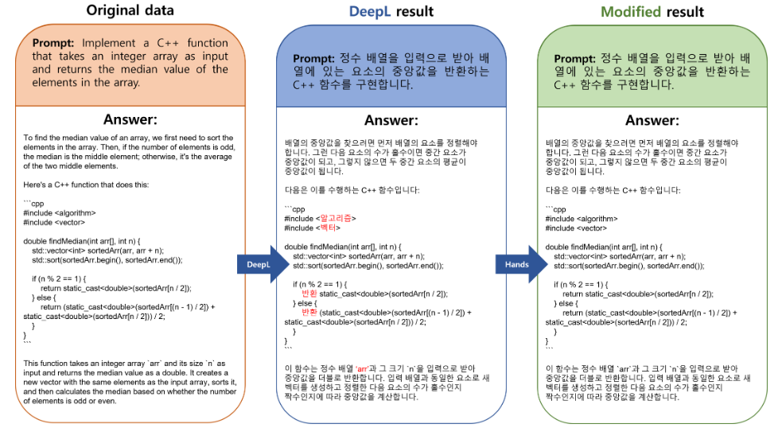

# KO-Platypus (Ko-Platy🥮)

<div align='center'>
<strong>Korean-Open-platypus 데이터셋을 활용하여 llama-2-ko를 fine-tuning한 Korean-Platypus model</strong> 
<br></br>

**KoT-Platypus2-13B🥮:** [](https://huggingface.co/kyujinpy/KoT-platypus2-13B)     
**KO-Platypus2-13B🥮:** [](https://huggingface.co/kyujinpy/KO-Platypus2-13B)     
**CoTy-platypus-ko🥮:** [](https://huggingface.co/MarkrAI/kyujin-CoTy-platypus-ko-12.8b)     
**KoT-platypus2-7B🥮:** [](https://huggingface.co/kyujinpy/KoT-platypus2-7B)  
**KO-Platypus2-7B🥮:** [](https://huggingface.co/kyujinpy/KO-Platypus2-7B-ex)  
**Poly-platypus-ko🥮:** [](https://huggingface.co/MarkrAI/kyujin-Poly-platypus-ko-12.8b)  
  
**KOpen-Platypus🥮:** [](https://huggingface.co/datasets/kyujinpy/KOpen-platypus)   
  
---
</div>
  
# Introduction
- 최근 **llama-2** 등장으로 LLM 분야가 다시 활발해지는 가운데, **Open-Platypus** 데이터셋 활용하여 llama-2를 fine-tuning한 **Platpyus** 모델이 등장하였습니다!🤗
- 하지만 Open-Platypus 데이터셋은 대부분 영어로만 구성되어 있기 때문에 한국어에 접목하기에는 한계가 있었습니다.
  
- 이것을 동기부여로 삼아서, 한국어 기반의 Open-Platypus 데이터셋을 제작한 후, **Ko-Platypus**를 만들기로 계획하였습니다!🙂🙂
- Open-Platypus를 DeepL Pro API를 활용하여 번역을 진행한 후, 약 25,000개의 데이터를 수작업으로 체크하였고 약 144시간 정도 소요하여서 번역 오류를 대부분 고쳤습니다😭😭
- 이렇게 만들어진 **🥮KOpen-Platypus🥮** 데이터셋을 활용하여 beomi님의 **llama-2-ko** 모델을 fine-tuning 하였습니다.
  
- 결과적으로 **Ko-Platypus2-7B-EX** 모델을 만들게 되었고✌, 성능평가를 위해 Polyglot-Ko와 llama-2-ko 모델과 비교를 진행했습니다.🙂🙃
- 본 연구는 (주)마커와 (주)미디어그룹사람과숲의 오픈소스 LLM 연구 컨소시엄에서 진행되었습니다.

# Model BenchMark(KO-LLM)  
| Model | Average | Ko-ARC | Ko-HellaSwag | Ko-MMLU | Ko-TruthfulQA | Ko-CommonGen V2 | Dataset | Base_model |  
| --- | --- | --- | --- | --- | --- | --- | --- | --- |  
| [KoT-Platypus2-13B](https://huggingface.co/kyujinpy/KoT-platypus2-13B) | 49.55 | 43.69 | 53.05 | 42.29 | 43.34 | 65.38 | [KoCoT](https://huggingface.co/datasets/kyujinpy/KoCoT_2000) | KO-platypus2-13B | 
| [KO-platypus2-13B](https://huggingface.co/kyujinpy/KO-Platypus2-13B) | 47.90 | 44.20 | 54.31 | 42.47 | 44.41 | 54.11 | [KOpen-platyus](https://huggingface.co/datasets/kyujinpy/KOpen-platypus) | ko-en-llama2-13b |  
| [CoTy-platypus-ko-12.8b](https://huggingface.co/MarkrAI/kyujin-CoTy-platypus-ko-12.8b) | 46.44 | 34.98 | 49.11 | 25.68 | 37.59 | 84.86 | [KoCoT](https://huggingface.co/datasets/kyujinpy/KoCoT_2000) | Poly-playtypus-ko-12.8b |  
| [KoT-platypus2-7B](https://huggingface.co/kyujinpy/KoT-platypus2-7B) | 45.62 | 38.05 | 49.63 | 34.68 | 37.69 | 68.08 | [KoCoT](https://huggingface.co/datasets/kyujinpy/KoCoT_2000) | KO-platypus2-7B |  
| [KO-Platypus2-7B](https://huggingface.co/kyujinpy/KO-Platypus2-7B-ex) | 45.41 | 39.08 | 50.86 | 34.60 | 37.94 | 64.55 | [KOpen-platyus](https://huggingface.co/datasets/kyujinpy/KOpen-platypus) | llama-2-ko-7B |  
| [Poly-platypus-ko-12.8b](https://huggingface.co/MarkrAI/kyujin-Poly-platypus-ko-12.8b) | 44.95 | 35.15 | 50.39 | 25.68 | 38.74 | 74.88 | [KOpen-platyus](https://huggingface.co/datasets/kyujinpy/KOpen-platypus) | Polyglot-ko-12.8b |  
| [CoT-llama-2k-7b](https://huggingface.co/kyujinpy/CoT-llama-2k-7b) | 41.54 | 36.77 | 49.38 | 29.80 | 37.76 | 53.99 | [KoCoT](https://huggingface.co/datasets/kyujinpy/KoCoT_2000) | llama-2-ko-7B |  
  
  
# Model Description  
  
### KO-Platypus2-7B-ex
- **llama-2-ko-7B를 fine-tuning한 모델**
- **🥮KO-Platypus2-7B-ex🥮** 모델은 zero-shot에서 llama-2-ko보다 높은 성능을 보여주었고, BoolQ의 경우에는 Polyglot-Ko보다 높은 성능을 보여주었습니다.✌✌
  
# News
- 2023.10.08
   - CoT 방식으로 re-fine-tuning한 [KoT-platypus-13B🤗](https://huggingface.co/kyujinpy/KoT-platypus2-13B) Model 제작 완료.  
   - HuggingFace KO-LLM 1등 달성.

- 2023.10.05
   - [ko-en-llama2-13b](https://huggingface.co/hyunseoki/ko-en-llama2-13b)를 기반으로 한 [Ko-platypus2-13B🤗](https://huggingface.co/kyujinpy/KO-Platypus2-13B) Model 제작 완료.  
   - HuggingFace KO-LLM 2등(~~1등~~) 달성.

- 2023.10.04
  - CoT방식으로 Poly-platypus-ko를 fine-tuning한 [CoTy-platypus-ko-12.8b🤗](https://github.com/KyujinHan/Poly-platypus-ko) Model 제작 완료.
  - HuggingFace KO-LLM 5등(~~2등~~) 달성.

- 2023.10.02
  - Polyglot-ko를 기반으로 하여 [Poly-platypus-ko-12.8b🤗](https://github.com/KyujinHan/Poly-platypus-ko) Model 제작 완료.  
  - HuggingFace KO-LLM 리더보드 ~~4등~~달성.

- 2023.10.01
  - CoT방식으로 re-fine-tuning한 [KoT-platypus2-7B🤗](https://github.com/KyujinHan/KoT-platypus) Model 제작 완료. 
  - HuggingFace KO-LLM 리더보드 ~~5등~~(~~1등~~) 달성. 
  
- 2023.09.29
  - [Ko-platypus2-7B🤗](https://huggingface.co/kyujinpy/KO-Platypus2-7B-ex) Model [KO-LLM leaderboard🤗](https://huggingface.co/spaces/upstage/open-ko-llm-leaderboard)에서 ~~2등~~(~~1등~~) 달성.
   
# Quick start
```python
### KO-Platy
from transformers import AutoModelForCausalLM, AutoTokenizer
import torch

repo = "kyujinpy/KO-Platypus2-7B-ex"
ko_platypus = AutoModelForCausalLM.from_pretrained(
        repo,
        return_dict=True,
        torch_dtype=torch.float16,
        device_map='auto'
)
ko_platypus_tokenizer = AutoTokenizer.from_pretrained(repo)
```
  
# Training 
1. First download the origina repo [Platypus](https://github.com/arielnlee/Platypus)
2. 🥮Run the file🥮: [](https://colab.research.google.com/drive/1qtGQroKPwGFA1L9b3WGyHC84NDIEs6s_?usp=sharing)
  
>*Note: You must access the original [llama-2](https://huggingface.co/meta-llama/Llama-2-7b).      
>**Note: You must generate your huggingface token. And after login, you can implement this [colab](https://colab.research.google.com/drive/1qtGQroKPwGFA1L9b3WGyHC84NDIEs6s_?usp=sharing).  
>***Note: If you run Platypus in colab, you must use A100 GPU.  

# Datasets
```python
from datasets import load_dataset

# dataset testing
dataset = load_dataset("kyujinpy/KOpen-platypus")
```  
**KOpen-Platypus🥮:** [](https://huggingface.co/datasets/kyujinpy/KOpen-platypus)   
> I think that **KOpen-Platypus** is higher quality korean-translation dataset than just using DeepL. Because I almost check translation-error.  

**Procedure**  
- First, I use [DeepL Pro API](https://www.deepl.com/translator) and [Selenium Code](https://github.com/KyujinHan/Korean_selenium_DeepL).
- Second, checking all data. If there are some errors, I modify translation myself.
*If you want more detail, see below `Post-procesing`.  
  
## Post-processing

I focus about **5 type errors.**  
1. Result of just code  
2. Result of code+explanation   
3. Float missing   
4. Math symbol   
5. Not translation or cut off translation result
  
>*Note: If you want to see more detail example, visit [huggingface](https://huggingface.co/datasets/kyujinpy/KOpen-platypus) or [Ko-Platypus-blog](https://kyujinpy.tistory.com/101).  
  
# Performance(Old_version)
When I evaluated Ko-Platy, I used this [repo](https://github.com/Beomi/ko-lm-evaluation-harness).  
And, implement below code.
```
# In colab,
!python main.py \
    --model gpt2 \ 
    --model_args pretrained=..your_model_name.. \
    --tasks kobest_hellaswag,kobest_copa,kobest_boolq,kobest_sentineg \
    --device cuda:0 \
    --num_fewshot 0 # 5, 10, 25, ...
```
  
### COPA (F1)
| Model | 0-shot | 5-shot | 10-shot | 50-shot |
| --- | --- | --- | --- | --- |
| [Polyglot-ko-1.3b](https://huggingface.co/EleutherAI/polyglot-ko-1.3b) | 0.7196 | 0.7193 | 0.7204 | 0.7206 |
| [Polyglot-ko-3.8b](https://huggingface.co/EleutherAI/polyglot-ko-3.8b) | 0.7595 | 0.7608 | 0.7638 | 0.7788 |
| [Polyglot-ko-5.8b](https://huggingface.co/EleutherAI/polyglot-ko-5.8b) | 0.7745 | 0.7676 | 0.7775 | 0.7887 |
| [Polyglot-ko-12.8b](https://huggingface.co/EleutherAI/polyglot-ko-12.8b) | 0.7937 | 0.8108 | 0.8037 | 0.8369 |
| [Llama-2-Ko-7b 20B](https://huggingface.co/beomi/llama-2-ko-7b) | 0.7388 | 0.7626 | 0.7808 | 0.7979 |
| [Llama-2-Ko-7b 40B](https://huggingface.co/beomi/llama-2-ko-7b) | 0.7436 | 0.7927 | 0.8037 | 0.8259 |  
| **KO-platypus2-7B-EX(ours)** | 0.7509 | 0.7899 | 0.8029 | 0.8290 |   
  
### HellaSwag (F1)
| Model | 0-shot | 5-shot | 10-shot | 50-shot |
| --- | --- | --- | --- | --- |
| [Polyglot-ko-1.3b](https://huggingface.co/EleutherAI/polyglot-ko-1.3b) | 0.5247 | 0.5260 | 0.5278 | 0.5427 |
| [Polyglot-ko-3.8b](https://huggingface.co/EleutherAI/polyglot-ko-3.8b) | 0.5707 | 0.5830 | 0.5670 | 0.5787 |
| [Polyglot-ko-5.8b](https://huggingface.co/EleutherAI/polyglot-ko-5.8b) | 0.5976 | 0.5998 | 0.5979 | 0.6208 |
| [Polyglot-ko-12.8b](https://huggingface.co/EleutherAI/polyglot-ko-12.8b) | 0.5954 | 0.6306 | 0.6098 | 0.6118 |
| [Llama-2-Ko-7b 20B](https://huggingface.co/beomi/llama-2-ko-7b) | 0.4518 | 0.4668 | 0.4726 | 0.4828 |
| [Llama-2-Ko-7b 40B](https://huggingface.co/beomi/llama-2-ko-7b) | 0.4562 | 0.4657 | 0.4698 | 0.4774 |   
| **KO-platypus2-7B-EX(ours)** | 0.4571 | 0.4461 | 0.4371 | 0.4525 |   
  
### BoolQ (F1)
| Model | 0-shot | 5-shot | 10-shot | 50-shot |
| --- | --- | --- | --- | --- |
| [Polyglot-ko-1.3b](https://huggingface.co/EleutherAI/polyglot-ko-1.3b) | 0.3552 | 0.4751 | 0.4109 | 0.4038 |
| [Polyglot-ko-3.8b](https://huggingface.co/EleutherAI/polyglot-ko-3.8b) | 0.4320 | 0.5263 | 0.4930 | 0.4038 |
| [Polyglot-ko-5.8b](https://huggingface.co/EleutherAI/polyglot-ko-5.8b) | 0.4356 | 0.5698 | 0.5187 | 0.5236 |
| [Polyglot-ko-12.8b](https://huggingface.co/EleutherAI/polyglot-ko-12.8b) | 0.4818 | 0.6041 | 0.6289 | 0.6448 |
| [Llama-2-Ko-7b 20B](https://huggingface.co/beomi/llama-2-ko-7b) | 0.3607 | 0.6797 | 0.6801 | 0.6622 |
| [Llama-2-Ko-7b 40B](https://huggingface.co/beomi/llama-2-ko-7b) | 0.5786 | 0.6977 | 0.7084 | 0.7144 |  
| **KO-platypus2-7B-EX(ours)** | 0.6028 | 0.6979 | 0.7016 | 0.6988 |  
  
### SentiNeg (F1)
| Model | 0-shot | 5-shot | 10-shot | 50-shot |
| --- | --- | --- | --- | --- |
| [Polyglot-ko-1.3b](https://huggingface.co/EleutherAI/polyglot-ko-1.3b) | 0.6790 | 0.6257 | 0.5514 | 0.7851 |
| [Polyglot-ko-3.8b](https://huggingface.co/EleutherAI/polyglot-ko-3.8b) | 0.4858 | 0.7950 | 0.7320 | 0.7851 |
| [Polyglot-ko-5.8b](https://huggingface.co/EleutherAI/polyglot-ko-5.8b) | 0.3394 | 0.8841 | 0.8808 | 0.9521 |
| [Polyglot-ko-12.8b](https://huggingface.co/EleutherAI/polyglot-ko-12.8b) | 0.9117 | 0.9015 | 0.9345 | 0.9723 |
| [Llama-2-Ko-7b 20B](https://huggingface.co/beomi/llama-2-ko-7b) | 0.4855 | 0.8295 | 0.8711 | 0.8513 |
| [Llama-2-Ko-7b 40B](https://huggingface.co/beomi/llama-2-ko-7b) | 0.4594 | 0.7611 | 0.7276 | 0.9370 |  
| **KO-platypus2-7B-EX(ours)** | 0.5821 | 0.7653 | 0.7991 | 0.8643 |  
   
# References
[Kopen-Platypus🥮](https://huggingface.co/datasets/kyujinpy/KOpen-platypus)   
[KO-Platypus2-7B-ex🥮](https://huggingface.co/kyujinpy/KO-Platypus2-7B-ex)  
[KO-Platypus2-13B🥮](https://huggingface.co/kyujinpy/KO-Platypus2-13B)  
[Platypus](https://github.com/arielnlee/Platypus)  
[llama-2](https://huggingface.co/meta-llama/Llama-2-7b)  
[llama-2-ko](https://huggingface.co/beomi/llama-2-ko-7b)  
[ko-en-llama2](https://huggingface.co/hyunseoki/ko-en-llama2-13b)  
[ko-lm-evaluation-harness](https://github.com/Beomi/ko-lm-evaluation-harness)   
  
# TODO
- [x] Make KO-Platypus-7B-EX  
- [x] Share huggingface repo
- [x] Share evaluation results
- [x] Share sample code

## Additional info about image
I made the image, inspired by [Platypus-LLM](https://github.com/arielnlee/Platypus).  
I used [Playground AI](https://playgroundai.com/), then applying prompt engineering. (For example, img2img, guidance etc...)  

When I made `Ko-Platy` image, I use prompt like below.
```
Prompt: 'Platypus wears a pretty traditional Korean clothes with 한국어 책'
Guidance: 10
Quality: 70~100
img2img: 'Platypus.png'
Model: SDXL
```  
